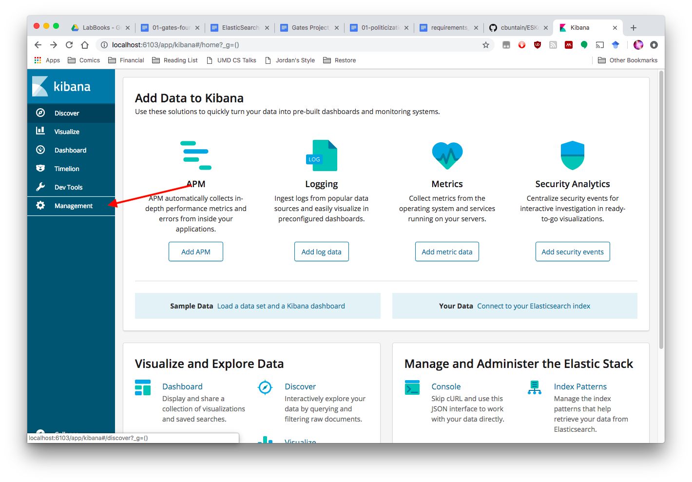
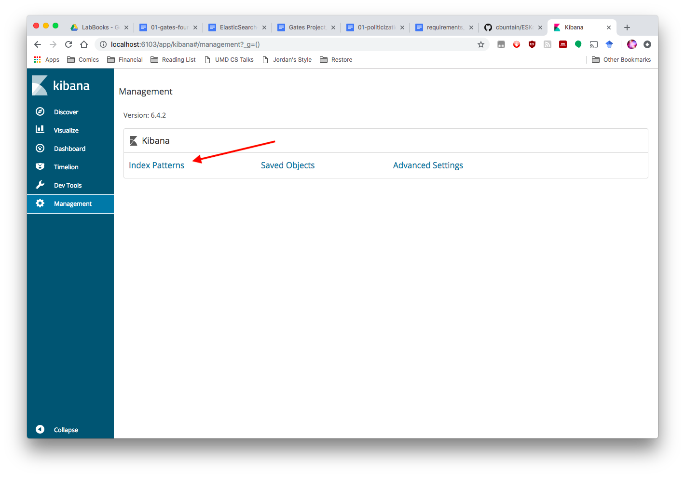
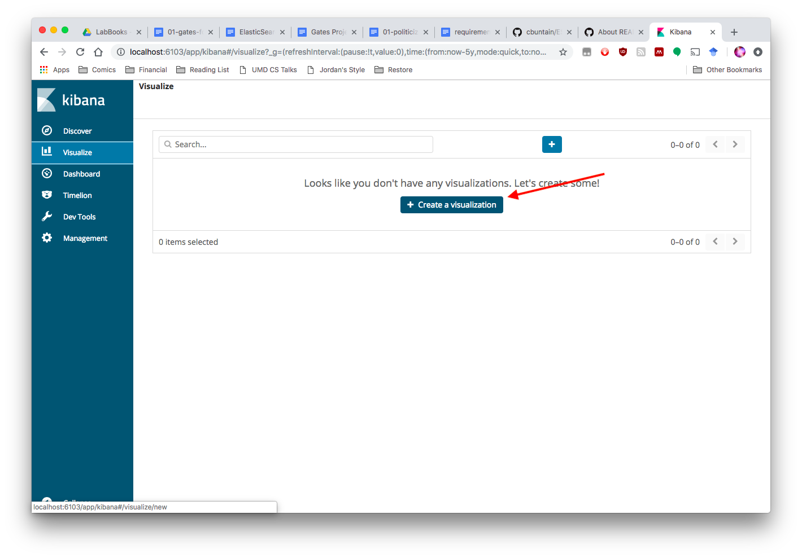
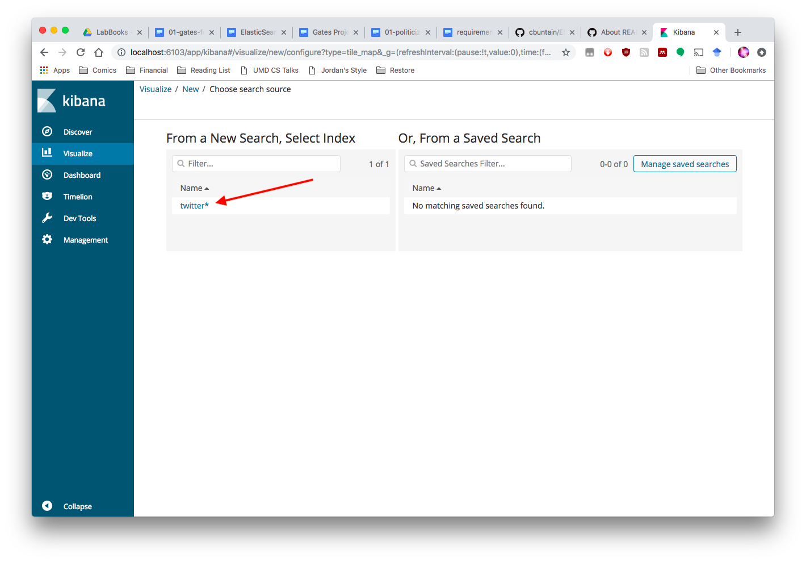

# ElasticSearch+Kibana on HPC Infrastructure

Repository of scripts for spinning up a personal instance of ElasticSearch and Kibana on HPC infrastructure (i.e., on Slurm)

## Setup Workflow

1. Download ElasticSearch and Kibana and decompress and create simlinks to support upgrades
	- Run `bash download.sh`
1. Update `run-es.sbatch` to correct path
1. Run `run-es.sbatch` to start ElasticSearch and Kibana. 
	- See slurm.log for port forwarding
1. Create your index with mappings for tweet metadata
	- `python createIndex.py http://localhost:<ESPORT> <index_name>`
1. Push tweet data to ElasticSearch
	- `python postTwitter.py http://localhost:<ESPORT> <index_name> <tweet_path.json`
1. Access Kibana and set up your index pattern
	- Create SSH tunnel to HPC, and visit `http://localhost:<KPORT>`, go to _Management_, and follow steps to point Kibana at the index `index_name` you created
1. Happy searching

## Setting Up Your Index

The second to last step above says to go to the _Management_ tab and set up your index. This process tells Kibana what dataset it needs to search and how it can interpret the time data in the `create_at` field in Twitter data (or whatever field in your data has date information).

Screenshots of the process follow:

1. Point your browser to Kibana. You'll first see 
1. Click _Management_ and go to _Index Patterns_. 
1. You'll now be asked to create an _index patten_ for whatever indices you have in your ElasticSearch setup. Use the __index name__ you created during setup and type it in to the text box. 
    -  The pattern supports wild cards and the like, so you can have one Kibana pattern for multiple indices (useful when you break down indices by day or month).
1. One of Kibana's real powers comes in handling time series. To enable this, you need to tell Kibana what field has your time data. If you're using Twitter data, select __created_at__ from the dropdown box. 

## Searching in Kibana

Now that you've set up Kibana, you can search your data. Some helpful screenshots for this follow:

1. You mainly search via the _Discover_ section. When you first go here though, Kibana may say there's no data. This lack of data is a result of Kibana's default timeframe filter (`Last 15 Minutes`). You'll want to change that to cover whatever date range your date covers. 
1. You can select from several pre-configured options or use your own range. I often use __Last 5 Years__ 
1. Your data should appear now! 

## Building Maps in Kibana

Kibana has a lot of visualization capability built into it. One really nice one is its mapping feature if your data already has geolocation (i.e., GPS) data available.

To build a map, follow these steps:

1. Go to the _Visualize_ tab, and select _Create Visualization_ 
1. Select the _Coordinate Map_ option 
1. Select your index (`twitter` in my case). 
1. Set up the geohash fields. Set `Aggregation` to `Geohash` and `field` to `coordinates.coordinates`. Press the `run` button (the triangle) to confirm and see your viz. 

